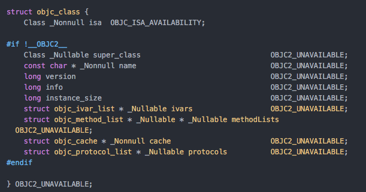
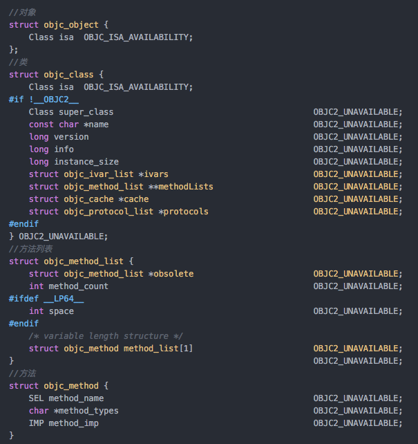

# iOS Runtime

参考链接：

[iOS 中的runtime与消息转发](https://www.jianshu.com/p/45db86af7b60)

O-C不能直接编译为汇编语言，而是要先转换为纯C语言再继续编译汇编。从O-C到C的变换就通过Runtime实现。

这个过程中需要将面向对象的类转换成面向过程的结构体。

#### 对象类(objc_class)

完整图：

O-C中的Class实际上是一个指向objc_class结构体的指针。

objc_method_list为方法列表，其元素为objc_method，method_name为方法名称，method_imp为其实现。

objc_cache为函数缓存，用于将objc_method_list中被调用过的方法记录下来，以免每次寻找方法时都要遍历一次objc_method_list。函数缓存以键值对形式存储，key为method_name，value为method_imp。

#### 对象实例(objc_object)

类对象objc_class包含一个isa指针，该isa指针指向的我们称之为元类(metaclass)。

而objc_object中的isa指针则指向相应的objc_class。

objc_class的super_class指向父类的objc_class；

metaclass的super_class指向父类的metaclass；

