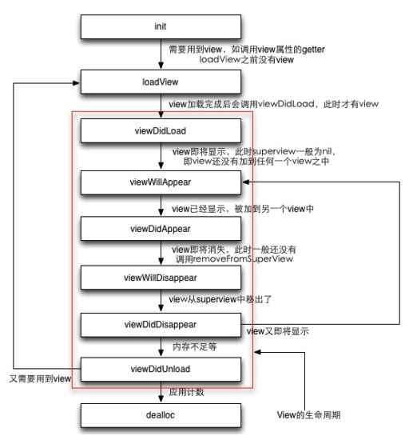

#  IOS移动应用开发实践报告13（第16周）

## 本周总体学习情况

由于小组项目中使用UITableView时出现了许多小问题，因此学习了一下相关的知识包括委托代理的使用，UITableView的运行和重用机制，以及VC的生命周期等。

## Delegate

委托代理（delegate）是指给一个对象提（代理）供机会对另一个对象（委托者）中的变化做出反应或者影响另一个对象的行为。

在IOS中委托代理通过协议@protocol实现。protocol是多个类共享的方法列表，这些方法在protocol中没有相应的实现，而是由遵循该protocol的各个代理类来分别实现的。协议中必须实现的方法由`@required`标识。

比如上次实现的底部弹出输入框视图的BottomBounceView，是使用block来将输入数据传入到父视图中的。这同样可以通过委托的方式实现。在BottomBounceView中定义一个协议，声明点击确认按钮后调用的协议方法。然后在需要使用BottomBounceView的父视图中遵循该协议并实现该协议方法。

委托者VCB（BottomBounceView）需要做的操作有：

- 定义Protocol及其中的方法：

  ```objective-c
  // VCB.h
  @protocol MyDelegate <NSObject>
  - (void)setText:(NSString *)text;
  @end
  ```

- 声明协议变量，变量类型为`id<协议名>`：

  ```objective-c
  // VCB.h
  @interface VCB : UIViewController
  @property (nonatomic, weak)id<MyDelegate> delegate;
  @end
  ```

- 代理者的设置（在程序中一般在代理者类中实现）：

  ```objective-c
  // VCA.m
  self.vcb = [[VCB alloc] init];
  self.vcb.delegate = self;
  ```

- 利用协议变量来调用协议的方法，从而让代理者执行协议

  首先需要用`respondsToSelector`方法来判断代理者是否实现了协议中相应的方法，如果实现了，则调用之：

  ```objective-c
  - (void)okButtonClick {
  	if([_delegate respondsToSelector:@selector(setText:)]) {
    	[_delegate setText: self.textView.text];
    }
  }
  ```

而代理者VCA（父视图）需要做的事有：

- 遵循委托协议：

  ```objective-c
  // VCA.m
  @interface VCA ()<MyDelegate>
  @property (nonatomic, strong) UILabel *label;
  @property (nonatomic, strong) VCB *vcb;
  @end
  ```

- 实现协议中定义的方法，即得到输入数据后进行的操作：

  ```objective-c
  // VCA.m
  #pragma mark MyDelegate
  - (void)setText:(NSString *)text {
    self.label.text = text;
  }
  ```


## UITableView

最常见的使用Delegate的例子就是UITableView。其包含`<UITableViewDelegate, UITableViewDataSource>`两个协议。

### 运行机制

UITableView的运行机制大致如下：

- 视图加载

  - view的加载

    `viewDidLoad`

    `viewWillAppear`

  - 加载数据源，此过程中会多次调用下面的方法：

    `numberOfSectionsInTableView:`

    `numberOfRowsInSection:`

  - 加载cell，对于数据源中的每个元素，都会执行下面的步骤，但执行次数不会超过页面能容下的cell行书（重用机制）：

    首先调用`cellForRowAtIndexPath`

    然后调用多次`heightForRowAtIndexPath:`

  - 之后仍需要调用与数据源元素数相应次数的

    `heightForRowAtIndexPath:`

  - 最后view显示出来

    `viewDidAppear`

### 重用原理

UITableView中包含两个cell池，visibleCells和reusableTableCells，前者为一个可变数组，保存当前显示的cells，后者为一个可变字典，保存可重用的cells，相应的key为`identify`。

此外还有一个方法`dequeueReusableCellWithIdentifier`，用于列出所有可重用的cells。

当UITableView滚动的时候，会先在`reusableTableCells`中根据`identify`找是否有有已经缓存的cell，如果有直接用，没有再去初始化。

```objective-c
static NSString *cellID = @"cell";
//根据identify在缓存的字典中找是否有已经初始化好的cell
UITableView *cell = [tableView dequeueReusableCellWithIdentifier:cellID];
if (!cell) {
	cell = [[HORTransitReportCell alloc] initWithStyle:UITableViewCellStyleValue2 reuseIdentifier:cellID];
}
return cell;
```


## 生命周期

这里顺便学习了一下UIView及UIViewController的生命周期，大体如下图所示：



整个周期的流程大致为：

- 使用alloc为VC申请了内存并用`init`初始化，此时VC中的`view`还是没有创建的。
- 当调用了view的getter(`self view`)时，首先判断view是否已创建，若没有创建，则调用`loadView`来创建view。
- view创建完后就会调用`viewDidLoad`。
- 当view被加入到其他view之中时，会顺序调用`viewWillAppear`和`viewDidAppear`。
- 当view要从其他view中移除时，顺序调用`viewWillDisappear`和`viewDidDisappear`。
- 当内存不足且view已经移除时，VC会将view释放，此时会调用`viewDidUnload`，之后view会指向nil。
- 当VC再次需要载入view时就会回到`loadView`的步骤。