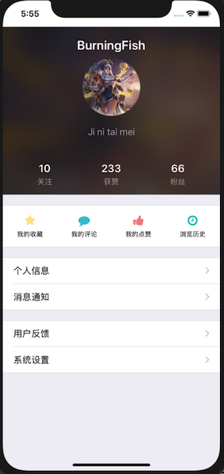

# IOS移动应用开发第五周实践报告

## 本周总体学习情况

因为要开始做小组项目了，所以这周试着做了一个profile的demo界面。之前在学习界面布局和控件逻辑的时候多是使用StoryBoard，但是这样不利于团队项目的版本管理，所以这次放弃了StoryBoard，改用纯代码进行相关操作。这里总结一下制作过程中涉及的知识点：

- 基于NSOperation的多线程操作
- 富文本和iconfont的使用
- 使用UIVisualEffectView实现一些特别的UI效果




### 异步加载网络图片

通过URL加载网络图片通常要用到异步的方法，在IOS中通过`NSOperationQueue`和`NSInvocationOperation`来实现。IOS的多线程操作主要是基于GCD的，而`NSOperationQueue`和`NSInvocationOperation`就是对GCD的更高一层封装，是面向对象的，并且比GCD更简单易用。

`NSOperation`中比较重要的两个概念是操作(Operation)和操作队列(Operation Queues)。

操作就是要在线程中执行的某段代码，类似于GCD中使用的block，`NSOperation`可以使用其子类`NSInvocationOperation`或`NSBlockOperation`来设置相应的操作。

操作队列则是用于存放操作的队列。当操作加入到`NSOperationQueue`中时，首先进入准备就绪状态，然后根据各操作之间的相对优先级来确定执行顺序。`NSOperationQueue`定义了两种类型的队列，运行在主线程上的为主队列，在后台执行的为自定义队列。

用`NSOperation`实现多线程异步操作时需要配合`NSOperationQueue`使用，基本的步骤都是创建操作和队列，再将操作对象添加到队列中，之后系统就会将队列中的操作取出来放到新的线程中执行。操作队列有一个属性：最大并发操作数(maxConcurrentOperationCount)，它在默认情况下为-1，即操作可以并发执行；当将其设为1时，队列中的操作就会串行执行。

以异步加载网络图片为例，首先创建`NSOperationQueue`对象和`NSInvocationOperation`对象，前者用`init`方法创建自定义队列，后者在创建时可以指定selector，即相应的操作函数。然后用`(void)addOperation:(NSOperation *)op`向队列中添加操作：

```objective-c
NSOperationQueue *operationQueue = [[NSOperationQueue alloc] init];
NSInvocationOperation *op = [[NSInvocationOperation alloc] initWithTarget:self selector:@selector(downloadImage) object:nil];
[operationQueue addOperation:op];
```

在selector函数中执行网络访问操作，创建URL，然后使用NSData的`dataWithContentsOfURL`即可获得相应的二进制对象。对于图片，可以将其转换为UIImage对象。

最后调用`(void)performSelectorOnMainThread:(SEL)aSelector withObject:(id)arg waitUntilDone:(BOOL)wait`方法可以将数据返回给主线程并执行UI更新操作。该方法中的aSelector指定了要执行的函数，arg为相应的参数，wait为一个布尔值，用于设置是否阻塞当前线程直到指定选择器在主线程中执行完毕。

```objective-c
- (void)downloadImage {
    NSURL *imageURL = [NSURL URLWithString:@"https://hbimg.huabanimg.com/954d812b554d7a23dda1b59c0f807446798aefa839a47-H6Z5G4_fw658"];
    NSData *imageData = [NSData dataWithContentsOfURL:imageURL];
    UIImage *image = [UIImage imageWithData:imageData];
    [self performSelectorOnMainThread:@selector(updateUI:) withObject:image waitUntilDone:YES];
}
```

```objective-c
- (void)updateUI:(UIImage*)image {
    self.backgroundImg.image = image;
    self.userHeadImg.image = image;
}
```

这里总结一下`NSOperation`和`NSOperationQueue`的常用属性和方法：

NSOperation：

|                   方法                   |             作用             |
| :--------------------------------------: | :--------------------------: |
|              (BOOL)isReady               | 判断某个操作是否处于就绪状态 |
|            (BOOL)isExecuting             |     判断操作是否正在执行     |
|             (BOOL)isFinished             |       判断操作是否结束       |
|            (BOOL)isCancelled             |      判断操作是否被取消      |
|               (void)cancel               |         取消某个操作         |
|         (void)waitUntilFinished          |  阻塞当前线程直到此操作结束  |
|  (void)addDependency:(NSOperation *)op   |         添加依赖操作         |
| (void)removeDependency:(NSOperation *)op |         移除依赖操作         |

NSOperationQueue：

|                             方法                             |                作用                |
| :----------------------------------------------------------: | :--------------------------------: |
|             (void)addOperation:(NSOperation *)op             |            添加操作对象            |
|      (void)addOperationWithBlock:(void (^)(void))block       | 添加NSBlockOperation类型的操作对象 |
| (void)addOperations:(NSArray *)ops waitUntilFinished:(BOOL)wait |   添加操作数组，wait指定是否阻塞   |
|                    (NSArray *)operations                     |      返回当前队列中的操作数组      |
|                  (NSUInteger)operationCount                  |      返回当前队列中的操作数量      |
|           (void)waitUntilAllOperationsAreFinished            |    阻塞当前线程直到操作全部结束    |


### 毛玻璃效果

`UIVisualEffect`是一个集成自`NSObject`的基类，它有两个子类：`UIBlurEffect`和`UIVibrancyEffrct`，前者可用于实现模糊效果，后者可以在模糊效果上实现其他的特殊效果。

`UIVisualEffectView`则是一个视图对象，它提供了一种简单的方式来实现复杂的视觉效果。它作为一个遮罩视图，透过遮罩视图，看到后面的视图就会覆盖一层特殊效果。

```objective-c
UIBlurEffect *blur = [UIBlurEffect effectWithStyle:UIBlurEffectStyleDark];
UIVisualEffectView *effectview = [[UIVisualEffectView alloc] initWithEffect:blur];
effectview.frame = CGRectMake(0, 0, self.backgroundImg.frame.size.width, self.backgroundImg.frame.size.height);
[self.backgroundImg addSubview:effectview];
```


### 富文本的使用

制作带Icon和文字的按钮可以使用富文本`NSMutableAttributedString`。


#### Iconfont

对于Icon，如果使用图片的话需要考虑分辨率的适配，并且会增大APP的体积，因此选择使用`iconfont`。生成iconfont需要矢量图，可以使用一些网站提供的现成iconfont服务，比如这里使用的[Fontello](http://fontello.com)。在这些网站选择了需要的图标并打包下载后一般会包含`.ttf`字体集文件，我们需要先将其导入项目中。

首先将该ttf文件导入到Xcode的项目根目录下，然后在`info.plist`中进行设置，添加一行`Fonts provided by application`字段。该字段是一个数组，用于向项目中添加新的字体集，将其第一个元素Item 0的属性设置为该字体文件的名称即可。可以在应用运行时输出`[UIFont familyNames]`中的内容查看是否成功导入了字体。

在O-C中使用这些iconfont时需要知道对应的Unicode，形式为`@"\UXXXXXXXX"`。各图标的unicode可以在`.ttf`文件目录下的`.svg`文件中查看。在设置文字时将其字体属性通过`UIFont`的`fontWithName:size:`改为iconfont的名称就可以使用了。

#### NSMutableAttributedString

`NSMutableAttributedString`对象可以管理字符串中单个字符或一定范围内的字符的属性集，比如字体字号颜色等。

`NSMutableAttributedString`可以使用字符串来进行初始化：`initWithString:`。

通过`(void)addAttribute:(NSString *)name value:(id)value range:(NSRange)range`方法可以设置相应的属性。其中Attribute指定要修改的多属性；value为新的属性值；range为作用的字符串范围，一般可以用NSString的`rangeOfString`获得。常用的富文本属性有：

|              key               |                 对应属性                 |
| :----------------------------: | :--------------------------------------: |
| NSForegroundColorAttributeName |        文字颜色，其value为UIColor        |
|      NSFontAttributeName       |           字体，value为UIFont            |
| NSParagraphStyleAttributeName  | 段落风格，value为NSMutableParagraphStyle |

其中NSParagraphStyleAttributeName又附带多种段落排版格式属性，当文字较多或需要分行时会有用：

|        name         |   对应属性   |
| :-----------------: | :----------: |
|     lineSpacing     |   段落行距   |
|      alignment      | 文本对齐方式 |
|  paragraphSpacing   |    段间距    |
| firstLineHeadIndent |   首行缩进   |

下面是生成第一个按钮的代码：

```objective-c
// 段落属性，设置行距
NSMutableParagraphStyle *paraStyle = [[NSMutableParagraphStyle alloc] init];
paraStyle.lineSpacing = 8.0f;
paraStyle.alignment = NSTextAlignmentCenter;
// collection icon
self.collecionIcon = ({
    UIButton *icon = [[UIButton alloc] initWithFrame:CGRectMake(0, 390, self.view.frame.size.width/4, 80)];
    [icon setTitle:@"\U0000E800\n我的收藏" forState:UIControlStateNormal];
    icon.titleLabel.font = [UIFont systemFontOfSize:ICON_LABEL_SIZE];
    NSMutableAttributedString *str0 = [[NSMutableAttributedString alloc] initWithString:icon.titleLabel.text];
    [str0 addAttribute:(NSString*)NSForegroundColorAttributeName value:[UIColor blackColor] range:[icon.titleLabel.text rangeOfString:@"我的收藏"]];
    [str0 addAttribute:(NSString*)NSForegroundColorAttributeName value:ZXColorFromRGB(0xfce38a) range:[icon.titleLabel.text rangeOfString:@"\U0000E800"]];
    [str0 addAttribute:(NSString*)NSFontAttributeName value:[UIFont fontWithName:@"fontello" size:ICON_SIZE] range:[icon.titleLabel.text rangeOfString:@"\U0000E800"]];
    [str0 addAttribute:(NSString*)NSParagraphStyleAttributeName value:paraStyle range:[icon.titleLabel.text rangeOfString:icon.titleLabel.text]];
    [icon setAttributedTitle:str0 forState:UIControlStateNormal];
    icon.titleLabel.lineBreakMode = NSLineBreakByCharWrapping;
    icon;
});
```

当不再需要富文本的某个属性时可以通过`(void)removeAttribute:(NSString *)name range:(NSRange)range`将其移除。