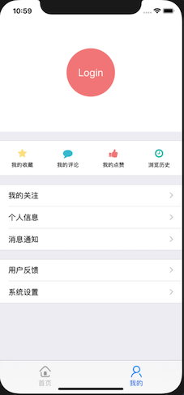
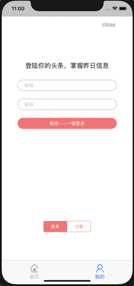
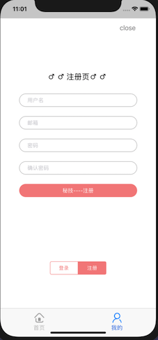

# IOS移动应用开发第六周实践报告

## 本周总体学习情况

本周完成了小组项目中的个人页面以及登录注册界面的基本布局和跳转，以及跳转时一些控件的动画效果。涉及的知识点有：

- 使用Masonry库进行约束布局
- 使用CGAffineTransform实现控件动画
- 子控制器的使用


### Masonry约束布局的使用

为使IOS程序能够适配各种尺寸的设备，在布局时需要进行约束，Masonry就是一个广泛使用的用于约束布局的第三方库。

安装该库时需要在`Podfile`中加上`pod 'Masonry'`，然后pod install即可。

Masonry的约束操作需要放在控件被`addSubview`之后。

Masonry的基础API如下：

```objective-c
mas_makeConstraints:					//添加约束
mas_remakeConstraints:				//移除并添加新的约束
mas_updateConstraints:				//更新约束
mas_equalTo:									//赋值，用于数值
equalTo:											//赋值，用于某个控件或某个约束
multipliedBy:									//乘以倍数
```

Masonry可以对控件的尺寸、边框位置、中心点等属性进行约束。

在添加约束时可以使用`and`或`with`修饰语来同时约束多个属性，简化操作。

`mas_makeConstraints:`方法的参数为一个block，在该block中为控件添加约束，该block有一个make对象参数，可以将其理解为需要添加约束的控件。约束的操作都是基于make进行的：

```objective-c
UIView *view = [[UIView alloc] init];
[self.view addSubview:view];
[view makeConstraints:^(MASConstraintMaker *make){
  	//直接设置尺寸
    make.width.mas_equalTo(80);
    make.height.mas_equalTo(80);
  	//使用修饰语and来简化操作
  	make.width.and.height.equalTo(80);
  	//用CGSizeMake设定尺寸
		make.size.mas_equalTo(CGSizeMake(200, 200));
  	//用另一个控件的尺寸来赋值
  	make.size.equalTo(view2);
  	//使用multipliedBy来乘以一个缩放系数
  	make.size.equalTo(self.view).multipliedBy(0.5);
  
  	//设置边框位置，与父元素的边框对应位置相同，并可以设置offset来调整边距
  	make.top.mas_equalTo(self.view).offset(10);
    make.left.mas_equalTo(self.view).offset(10);
  	//可以直接对edges属性进行约束来确定四边的位置，并且可以用insets来设置四个边距
  	make.edges.equalTo(self.view).insets(UIEdgeInsetsMake(50, 50, 50, 50));
  
  	//设置中心点，将中心点设为与父元素相同可以使控件在父元素内居中
  	make.center.equalTo(self.view);
  	//也可以分别设置x和y中心点，实现水平或垂直居中
  	make.centerX.equalTo(self.view.centerX);
    make.centerY.equalTo(self.view.centerY);
}];
```

当需要改变控件的约束时可以用下面两个方法，与添加约束的操作相同：

```objective-c
[view mas_remakeConstraints:^(MASConstraintMaker *make) {
		//将原有约束全部删除并添加上新的约束
}];
[view mas_updateConstraints:^(MASConstraintMaker *make) {
		//将原有的相同约束用新的值覆盖掉
  	//原有的其他约束不受影响（只会更新与其对应的约束）
}];
```


### 控件动画

为控件增加动画效果有两种方式：

#### 首尾方式：

在`beginAnimations`和`commitAnimations`之间设置变化属性和动画时长：

```objective-c
[UIView beginAnimations:nil context:nil];
//time
[UIView setAnimationDuration:2.0];
self.view1.alpha = 0;
self.view2.transform = CGAffineTransformTranslate(self.part1.transform, 0, 70);
[UIView commitAnimations];
```

#### block方式：

该方式中可以设置两个block，一个为`animations:`，用于设置变化属性，另一个为`completion:`设置动画播放完后的其他操作：

```objective-c
[UIView animateWithDuration:2.0 animations:^{
		self.view1.alpha = 0;
} completion:^(BOOL finished) {
		[self.view1 removeFromSuperview];
}];
```

#### Transform变换：

利用transform 可以修改空间的位移(位置)、缩放、旋转：

```objective-c
//创建一个transform属性
CGAffineTransform CGAffineTransformMakeTranslation(CGFloat tx,  CGFloat ty) ;
CGAffineTransform CGAffineTransformMakeScale(CGFloat sx, CGFloat sy);
CGAffineTransform CGAffineTransformMakeRotation(CGFloat angle);
//在某个transform的基础上进行叠加
CGAffineTransform CGAffineTransformTranslate(CGAffineTransform t, CGFloat tx, CGFloat ty);
CGAffineTransform CGAffineTransformScale(CGAffineTransform t, CGFloat sx, CGFloat sy);
CGAffineTransform CGAffineTransformRotate(CGAffineTransform t, CGFloat angle);
```

将设置好的`CGAffineTransform`赋值到控件的transform属性上即可赋予动画。


### 子控制器和父控制器

IOS中的每个视图View都有两个属性：`superview`和`subviews`，分别用于获取View的父视图和子视图（数组）。

而每个View Controller也有两个类似的属性：`parentController`和`childController`，分别用于获取VC的父控制器和子控制器。

在IOS客户端中，多个 childViewController 的页面是个很常见的交互设计，与添加subView相比，添加ChildViewController使页面中的逻辑更清晰，一些重要的View能够有对应的ViewController。

#### 添加子控制器

添加一个子控制器并显示其View的步骤为：

- 创建子控制器
- 将子控制器添加到父控制器中
- 设置Frame
- 将子控制器的View添加到父控制器的View上
- 将父控制器通知给子控制器

```objective-c
self.loginVC = [[LoginViewController alloc] init];
[self addChildViewController:self.loginVC];
self.loginVC.view.frame = CGRectMake(0, 40, self.part3.frame.size.width, self.part3.frame.size.height);
[self.part3 addSubview:self.loginVC.view];
[self.loginVC didMoveToParentViewController:self];
```

#### 移除子控制器

将子控制器从父控制器中移除的步骤为：

- 通知子控制器将要移除
- 将子控制从父控制器中移除
- 将子控制器的View从父控制器的View中移除

```objective-c
[self.loginVC willMoveToParentViewController:nil];
[self.loginVC removeFromParentViewController];
[self.loginVC.view removeFromSuperview];
```

#### 获取父控制器

对于子控制器，可以直接访问`self.parentViewController`来获取父控制器。

对于子视图，则需要用到`UIResponder`。UIView、UIViewController都是UIResponder的子类，它们的`nextResponder`方法都能获取上一级父控件，因此可以利用响应链的原理，逐层获取父控件，直到该父控件的类为UIViewController，就得到了父控制器：

```objective-c
- (UIViewController *)viewController:(UIView *)view {
    for (UIView* next = [view superview]; next; next = next.superview) {
        UIResponder *nextResponder = [next nextResponder];
        if ([nextResponder isKindOfClass:[UIViewController class]]) {
            return (UIViewController *)nextResponder;
        }
    }
    return nil;
}
```


### 实践操作

这周实现的部分是在用户未登录时，在个人页面显示Login按钮，点击后弹出登录界面，并且可以通过底部的`UISegmentedControl`切换到注册页面：

|                           个人页面                           |                           登录界面                           |                           注册界面                           |
| :----------------------------------------------------------: | :----------------------------------------------------------: | :----------------------------------------------------------: |
|  |  |  |

其中点击按钮后从底部弹出界面用控件动画`CGAffineTransformMakeTranslation`实现。弹出的部分是一个单独的View，它包含两个subView，分别对应登录和注册界面的View，并且这两个subView均有对应的Controller，用于划分业务逻辑。这两个Controller都加入到了个人页面Controller的childViewController中。

底部的切换按钮为`UISegmentedControl`，它包含在父Controller中，在其代理事件中根据选中的index来改变两个childViewController的View的hidden属性即可实现切换。

```objective-c
#pragma segmentedControl
-(void)indexDidChangeForSegmentedControl:(UISegmentedControl *)sender {
    NSInteger selecIndex = sender.selectedSegmentIndex;
    switch (selecIndex) {
        case 0:
            //self.viewModel.operationType = LOGIN;
            self.loginVC.view.hidden = NO;
            self.signupVC.view.hidden = YES;
            break;
        case 1:
            //self.viewModel.operationType = SIGNUP;
            self.loginVC.view.hidden = YES;
            self.signupVC.view.hidden = NO;
            break;
        default:
            break;
    }
}
```

