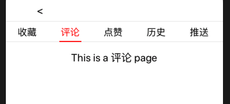

# IOS移动应用开发第七周实践报告

## 本周总体学习情况

本周主要实现了小组项目中个人界面内的分页界面，并简化了一下之前的代码，涉及的知识点有：

- O-C中属性的相关知识
- UIPageViewController的使用
- UICollectionView的使用

## 关于Objective-C中的属性

### 属性的实质

属性的实质就是成员变量加上它们的set和get方法。当声明一个属性，比如：

```objective-c
@property (nonatomic, strong) NSString *str
```

编译器会自动为该属性生成一个实例变量`_str`，并同时生成其set方法：`- (void)setStr:(NSString *)str`以及get方法：`- (NSString *)str`。

### 属性关键字

#### 读写权限

- readonly：属性只可读，编译器只会自动生成get方法，不会生成set方法。
- readwrite：属性可读可写（默认），编译器会为其生成set和get方法。

#### 原子性

- nonatomic：属性不具有原子性，不使用同步锁。

- atomic：编译器生成的set方法通过同步锁保证该属性的原子性，因此其存取方法是线程安全的，但是会有一定的性能开销：

  ```objective-c
  - (void)setStr:(NSString *)str{
       @synchronized(self) {
           _str = str;
       }
  }
  ```

#### 内存管理语义

- strong：属性被赋值时通过调用`objc_storeStrong`函数实现，该函数会将对象指针指向新的值，然后释放掉旧的值，并且新值的引用次数会+1.
- weak：用weak修饰的成员变量初始化之后就会被释放掉，当属性所指的对象释放的时候，属性也会被置为nil。多用于修饰UI控件。
- assign：可以用于修饰基本数据类型和对象类型，用于修饰对象时和weak类似，但是对象释放的时候不会被置为nil。
- copy：copy属性被赋值时，如果该属性是不可变的，则与strong相同；如果是可变的（NSMutable），赋值时会创会将指针指向新值的副本，且新值的引用次数不变。常用于修饰NSString。


## ARC


Copy是创建一个新对象，Retain是创建一个指针，引用对象计数加1。

Copy属性表示两个对象内容相同，新的对象retain为1 ，与旧有对象的引用计数无关，旧有对象没有变化。copy减少对象对上下文的依赖。

Retain属性表示两个对象地址相同（建立一个指针，指针拷贝），内容相同，这个对象的retain值+1也就是说，retain 是指针拷贝，copy 是内容拷贝。


## UIPageViewController的使用

UIPageViewController是一个分页空间，可以在多个子ViewController及其视图之间以滑动或翻页的效果切换，这里介绍一下常用的API以及使用方法。

### 子控制器的管理

首先将要用到的各个子页面的controller都放到一个数组中方便管理：

```objective-c
- (NSArray *)pages{
    if(_pages == nil){
        _pages = @[self.collectionVC, self.commentVC, self.likeVC, self.historyVC, self.recommendVC];
    }
    return _pages;
}
```

### 初始化

初始化UIPageViewController时可以指定`initWithTransitionStyle`，即切换页面的风格（滑动或翻页），以及`navigationOrientation`，即滑动的方向（左右或上下），此外还要指定一个`option`，它是一个NSDictionary，用于设置滑动或翻页效果中的一些属性，比如View之间的间距。

然后是指定`delegate`（代理协议）和`dataSource`（数据源协议），与UITableViewController类似，如果不指定这两项的话，会使PageViewController无法滑动。

```objective-c
- (UIPageViewController *)pageVC {
    if(_pageVC == nil){
        NSDictionary *option = [NSDictionary dictionaryWithObject:[NSNumber numberWithInteger:10] forKey:UIPageViewControllerOptionInterPageSpacingKey];
        _pageVC = [[UIPageViewController alloc]initWithTransitionStyle:UIPageViewControllerTransitionStyleScroll navigationOrientation:UIPageViewControllerNavigationOrientationHorizontal options:option];
        [_pageVC.view setFrame: CGRectMake(0, 130, self.view.frame.size.width, self.view.frame.size.height - 130)];
        _pageVC.delegate = self;
        _pageVC.dataSource = self;
    }
    return _pageVC;
}
```

### 可视化

要使UIPageViewController显示某个控制器的内容（即切换到某个页面），则需要使用如下方法：

```objective-c
- (void)setViewControllers:(nullable NSArray<UIViewController *> *)viewControllers direction:(UIPageViewControllerNavigationDirection)direction animated:(BOOL)animated completion:(void (^ __nullable)(BOOL finished))completion
```

该方法中的`viewControllers`是待显示的控制器，使用时可以根据当前的页面序号获取`pages`中的元素来显示。`direction`用于指定切换的方向，它是一个枚举型变量：

```objective-c
typedef NS_ENUM(NSInteger, UIPageViewControllerNavigationDirection) {
// 正向切换
    UIPageViewControllerNavigationDirectionForward,
// 反向切换
    UIPageViewControllerNavigationDirectionReverse
};
```

`animated`用于指定切换时是否附带动画效果。`completion`则是完成切换动画后的回调函数

### UIPageViewControllerDataSource 数据源方法

包含了UIPageViewController的数据源协议的类必须实现下面两个方法：

```objective-c
// 返回当前控制器的前一个控制器
- (nullable UIViewController *)pageViewController:(UIPageViewController *)pageViewController viewControllerBeforeViewController:(UIViewController *)viewController;
// 返回当前控制器的后一个控制器
- (nullable UIViewController *)pageViewController:(UIPageViewController *)pageViewController viewControllerAfterViewController:(UIViewController *)viewController;
```

在这两个方法中利用当前的页面index获取pages数组中的相应元素即可，但是需要判断边界条件，以前者为例：

```objective-c
- (nullable UIViewController *)pageViewController:(UIPageViewController *)pageViewController viewControllerBeforeViewController:(UIViewController *)viewController {
    NSInteger index = [self.pages indexOfObject:viewController];
    if (index == 0 || (index == NSNotFound)) {
        return nil;
    }
    index--;
    return [self.pages objectAtIndex:index];
}
```

当前面没有其他页面时，应该返回nil。

### UIPageViewControllerDelegate 代理方法

下面是用UIPageViewController及多个Button实现的模仿TabBar切换页面的效果。



首先创建各个UIButton对象并给它们设置一个Tag用于区分。然后分别设置normal状态和selected状态的字体颜色。将selected状态的初始值设为NO。在点击事件中，首先将所有Button的selected状态都设为NO，再获取点击到的那个按钮将其selected状态设为YES，即可实现单选的效果。接下来获取该Button的Tag，调用UIPageViewController的`setViewControllers`方法，将Tag对应序号的子控制器显示出来。这样就实现了通过按钮来切换子页面。

```objective-c
- (void)addButtons {
    int btnWidth = self.view.frame.size.width / self.titleArr.count;
    for(int i = 0; i < self.titleArr.count; i ++) {
        UIButton *btn = [UIButton buttonWithType:UIButtonTypeCustom];
        btn.frame = CGRectMake(btnWidth * i, 5, btnWidth, 30);
        [btn setTitle:_titleArr[i] forState:UIControlStateNormal];
        btn.titleLabel.font = [UIFont systemFontOfSize:18];
        btn.tag = i + BUTTON_TAG;               // tag
        btn.selected = NO;
        [btn setTitleColor:[UIColor blackColor] forState:UIControlStateNormal];
        [btn setTitleColor:[UIColor redColor] forState:UIControlStateSelected];
        
        [[btn rac_signalForControlEvents: UIControlEventTouchUpInside] subscribeNext:^(UIButton *x) {
            for (int i = 0; i < self.titleArr.count; i++) {
                UIButton *btn = (UIButton *)[self.view viewWithTag:BUTTON_TAG + i];
                [btn setSelected:NO];
                btn.subviews[1].hidden = YES;
            }														// 将其他按钮设为未选中状态
            [x setSelected:YES];				// 将被点击的按钮设为选中状态
            x.subviews[1].hidden = NO;	// 显示底部颜色指示器
            
            NSInteger index = x.tag - BUTTON_TAG;
            if(self.current_index != index){
                NSInteger direction;		// 根据index判断滑动的方向
                if(self.current_index < index){
                    direction = UIPageViewControllerNavigationDirectionForward;
                } else {
                    direction = UIPageViewControllerNavigationDirectionReverse;
                }
                self.current_index = index;	// 修改current index
                [self.pageVC setViewControllers:@[self.pages[self.current_index]] direction:direction animated:YES completion:^(BOOL finished){
                }];
            }
        }];
        [self.button_group addSubview:btn];
        // 按钮底部的颜色指示器
        UIView *line = [[UIView alloc] initWithFrame:CGRectMake(20, 32, btnWidth - 40, 2)];
        line.backgroundColor = [UIColor redColor];
        line.hidden = YES;
        [btn addSubview:line];
    }
}
```

此外还需要在通过手动滑动切换页面时，令按钮的selected状态相应地改变，这就需要用到UIPageViewController的一个代理方法方法`pageViewController:willTransitionToViewControllers:`：

```objective-c
- (void)pageViewController:(UIPageViewController *)pageViewController willTransitionToViewControllers:(NSArray<UIViewController *> *)pendingViewControllers {
    UIViewController *nextVC = [pendingViewControllers firstObject]; 
    NSInteger index = [self.pages indexOfObject:nextVC];
    self.current_index = index;
}
```

这个方法是手势滑动（或翻页）开始时的回调，`pendingViewControllers`是接下来会切换到的各个控制器，其`firstObject`方法会返回下一个VC，也就是滑动结束后显示的VC。利用该方法就能得到滑动后的页面index。接下来还需要使用滑动结束时的回调方法`- (void)pageViewController:(UIPageViewController *)pageViewController didFinishAnimating:(BOOL)finished previousViewControllers:(NSArray<UIViewController *> *)previousViewControllers transitionCompleted:(BOOL)completed`

该方法中的`finished`为是否完成滑动（翻页），而`completed`为是否成功切换页面。这样就可以根据上面获得的index以及这里的completed，在切换完成后相应地改变各按钮的状态。

