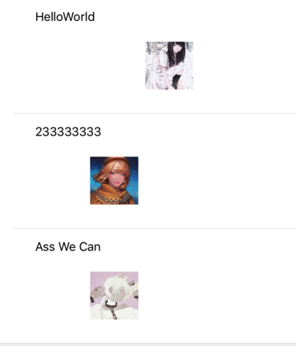

#  IOS移动应用开发第八周实践报告

## 本周总体学习情况

本周尝试实现了用自定义的UITableView来实现新闻列表，在各个Cell中通过SDWebImage库来加载网络图片，并且点击这些图片可以加入大图查看模式。目前这两个功能还是分开实现的，存在一些bug，有待进一步的整合和调试。




## 相关知识

### SDWebImage库的使用

SDWebImage是Github上一个开源的第三方库，专门用来处理网络图片加载的事件。在iOS图片加载框架中非常流行，它具有的特点如下：

- 异步下载图片
- 异步缓存，并且自动管理缓存有效性
- 后台图片解压缩
- 自动识别无效 URL，不会反复重试
- 使用 GCD 和 ARC

此外它可以应用到UIImageView, UIButton等多种控件中，十分方便。

#### pod安装：

在Profile中加上：

```objective-c
pod "SDWebImage","~> 4.0"
```

然后`pod install`，在项目代码中引入相关头文件即可：

 ```java
#import <SDWebImage/UIImageView+WebCache.h>  
 ```

#### 使用方式：

SDWebImage的常用方法如下：

对于UIImageView，可以使用UIImageView+WebCache等方式来获取图片：

```objective-c
[cell.imageView sd_setImageWithURL:[NSURL URLWithString:url] placeholderImage:[UIImage imageNamed:@"loading.png"]];
```

此外还可以使用block来进行回调，该回调会在图片加载完成时出发，可以在其中进行主线程更新UI或失败处理等操作。如果在加载完成前取消了操作，则不会触发回调。

```objective-c
[cell.imageView sd_setImageWithURL:[NSURL URLWithString:url] placeholderImage:[UIImage imageNamed:@"loading.png"] completed:^(UIImage *image, NSError *error, SDImageCacheType cacheType, NSURL *imageURL) {
    // 完成时回调
 }];
```

SDWebImageManager是SDWebImage的核心类。它拥有一个`SDWebImageCache`和一个`SDWebImageDownloader`属性，分别用于图片的缓存和下载处理。可以单独使用Manager来完成下载操作，以方便管理：

```objective-c
SDWebImageManager *manager = [SDWebImageManager sharedManager] ;
[manager downloadImageWithURL:imageURL options:0 progress:^(NSInteger receivedSize, NSInteger expectedSize) { 
      // progression tracking code
 }  completed:^(UIImage *image, NSError *error, SDImageCacheType cacheType, BOOL finished, NSURL *imageURL) { 
   if (image) { 
    // do something with image
   }
}];
```

SDWebImageDownloader也是一个用于下载操作的类，与其他方法不同的是这个类下载的图片不会自动缓存：

```objective-c
SDWebImageDownloader *downloader = [SDWebImageDownloader sharedDownloader];
[downloader downloadImageWithURL:imageURL
                             options:0
                            progress:^(NSInteger receivedSize, NSInteger expectedSize) {
                                // progression tracking code
                            }
                           completed:^(UIImage *image, NSData *data, NSError *error, BOOL finished) 														{
                               if (image && finished) {
                                   // do something with image
                             }
}];
```


### 使用convertRect进行UIView坐标系转换

在一些情况下需要转换控件所在的坐标系，比如点击图片进行放大预览时，要做出缩放的动画效果，就需要知道图片在屏幕中的位置，可以通过`convertRect`方法实现。

```objective-c
- (CGRect)convertRect:(CGRect)rect toView:(UIView *)view;
```

这个方法将rect由rect所在视图转换到目标视图view中，返回在目标视图view中的rect。

```objective-c
- (CGRect)convertRect:(CGRect)rect fromView:(UIView *)view;
```

这个方法将rect从view中转换到当前视图中，返回在当前视图中的rect。

除了获取控件在不同坐标系中的位置外，还可以对像素(CGPoint)进行这样的操作：

```objective-c
- (CGPoint)convertPoint:(CGPoint)point toView:(UIView *)view;
```

将像素point由point所在视图转换到目标视图view中，返回在目标视图view中的CGPoint。

```objective-c
- (CGPoint)convertPoint:(CGPoint)point fromView:(UIView *)view;
```

将像素point从view中转换到当前视图中，返回在当前视图中的CGPoint。

## 实践操作

### 在TableViewCell中加载网络图片

在自定义的TableViewCell类中有一个用于存放Item数据的`newsItem`对象，在该对象的set方法中进行相关的获取图片资源的操作，就能使得每次修改该Cell的数据时都触发一次这些操作。在获取图片时首先查看当前的应用缓存中是否包含相应的资源，如果没有才进行网络访问：

```objective-c
-(void) setNewsItem:(NewsItem *)newsItem {
		......
		for(int i = 0; i < count; i ++) {
    NSString *imgUrl = newsItem.imgUrlArray[i];
    UIImageView *img = self.contentView.subviews[count];
    UIImage *cachedImg = [[SDImageCache sharedImageCache] imageFromDiskCacheForKey:imgUrl];
    if (!cachedImg) {
        [self downloadImage:imgUrl forImageView:img];
    }else{
        img.image = cachedImg;
    }
}
```

使用`sd_setImageWithURL`方法来获取指定URL的网络图片，在获取到图片后需要用`dispatch_async`来在主线程中更新UI：

```objective-c
- (void)downloadImage:(NSString *)imageURL forImageView:(UIImageView *)imgView {
    [imgView sd_setImageWithURL:[NSURL URLWithString:imageURL] placeholderImage:[UIImage imageNamed:@"loading.jpg"]
                                               completed:^(UIImage * _Nullable image, NSError * _Nullable error, SDImageCacheType cacheType, NSURL * _Nullable imageURL) {
        dispatch_async(dispatch_get_main_queue(), ^{
            imgView.image = image;
        });
    }]; 
}
```

但是这样的操作仍存在Bug，就是当一个Cell中需要显示多张图片时，只有最后一张图片才会被显示出来，有待进一步DeBug。


### 点击查看大图

首先给图片加上一个点击手势事件：

```objective-c
UITapGestureRecognizer *tapGesture = [[UITapGestureRecognizer alloc]initWithTarget:self action:@selector(onImgClick:)];
[_testImg addGestureRecognizer:tapGesture];
```

因为查看大图时背景为黑色，且之后要实现滑动切换功能，所以这里使用一个`UIScrollView`来作为查看大图时的背景，在点击手势事件中创建该`UIScrollView`：

```objective-c
- (void) onImgClick:(UITapGestureRecognizer *)tap
```

```objective-c
//scrollView作为背景
UIScrollView *bgView = [[UIScrollView alloc] init];
bgView.frame = [UIScreen mainScreen].bounds;
bgView.backgroundColor = [UIColor blackColor];
```

在查看观察中点击屏幕会退出大图，因此为该`UIScrollView`也添加一个点击手势事件：

```objective-c
// 点击取消
UITapGestureRecognizer *tapGesture = [[UITapGestureRecognizer alloc] initWithTarget:self action:@selector(cancelFullScreen:)];
[bgView addGestureRecognizer:tapGesture];
```

这里的思路是在点击后复制出一个新的`UIImageView`，在这个新的图片上进行变换动画，该图片的`contentMode`将设为`UIViewContentModeScaleAspectFill`，使其按照原图比例进行缩放并充斥整个控件，再将`clipsToBounds`属性设为NO即可防止被剪裁，这样就能显示出完整的图片了。为了确定新图片的位置，这里需要使用`convertRect:`来获取原图片在当前屏幕上的位置，即从原图自身的坐标系转换到`self.view`的坐标系：

```objective-c
// 处理遮罩
bigImgView.image = picView.image;
bigImgView.contentMode = UIViewContentModeScaleAspectFill;
bigImgView.clipsToBounds = NO;
bigImgView.frame = [bgView convertRect:picView.frame fromView:self.view];
[bgView addSubview:bigImgView];
[self.view addSubview:bgView];
```

为了方便之后退出大图时还原图片的位置，需要先记录下相关的位置信息。同时为了实现之后的滑动切换功能，这里需要将当前正在显示的图片也记录下来：

```objective-c
// 记录原Frame
self.oriangeFrame = bigImgView.frame;
self.current_scroll_view = bgView;
self.current_show_img = picView;
self.current_show_big_img = bigImgView;
```

实现动画效果时，将新图片的宽度设为屏幕的宽度，并按比例计算出相应的高度，这样就能在占满屏幕宽度的情况下显示出完整的图片。同时将原图的透明度设为0来保证动画视觉上的流畅：

```objective-c
[UIView animateWithDuration:0.3 animations:^{   
    CGRect frame = bigImgView.frame;
    frame.size.width = bgView.frame.size.width;
    // 按比例缩放
    frame.size.height = frame.size.width * (bigImgView.image.size.height / bigImgView.image.size.width);
    frame.origin.x = 0;
    frame.origin.y = (bgView.frame.size.height - frame.size.height) * 0.5;
    bigImgView.frame = frame;  
    self.current_show_img.alpha = 0;    
} completion:^(BOOL finished) {   
}];
```

在退出大图的动画效果中需要将图片的`clipsToBounds`属性重新设为YES，这样可以体现出从不剪裁到剪裁到效果变换：

```objective-c
- (void) cancelFullScreen:(UITapGestureRecognizer *)tap {   
    [UIView animateWithDuration:0.3 animations:^{
        self.current_show_big_img.frame = self.oriangeFrame;
        self.current_show_big_img.clipsToBounds = YES;
        tap.view.backgroundColor = [UIColor clearColor];
    } completion:^(BOOL finished) {
        self.current_show_img.alpha = 1;
        [tap.view removeFromSuperview];
        self.current_scroll_view = nil;
        self.current_show_big_img = nil;
        self.current_show_img = nil;
    }];
}
```

