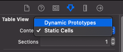
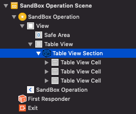
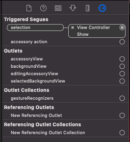
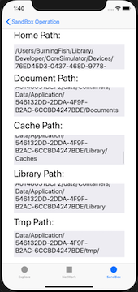
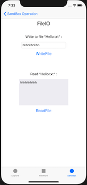

# IOS移动应用开发第四周实践报告

## 本周总体学习情况

本周主要学习内容如下：

- IOS沙盒相关的知识，即应用程序的文件存储路径
  - 沙盒中的文件目录分类
  - 访问沙盒中目录的方法
- 文件IO的相关知识
  - 基本的文件IO操作
  - 复杂对象的归档和解档

此外在实践的过程中学习到了一些使用storyboard的经验，比如设置静态表格和快速定义页面间的跳转等。

实践Project：[Github](https://github.com/T-Machine/IOS-Learning)


## StoryBoard使用经验

### 在storyboard中设置静态TableView

在storyboard中可以直接给TableView设置静态的元素，这样对于元素固定的表格就可以直接在storyboard中进行设置而不用在代码里操作了。

这里首先要有一个TableViewController，因为静态的元素必须在TableViewController中才能设置。然后在左侧的对象面板中选中TableView，将右侧属性面板中的Content属性改为Static Cells，如图：



Content属性下方的Sections属性是用来设置表格中的Section个数的，这里先设置为1.这样在左侧的对象面板里就能看到TableView对象中包含了一个TableViewSection对象。选中该对象后，可以在右侧面板设置rows属性，确定该Section中的元素行数。设定完后就能看到TableViewSection下多了几个TableViewCell对象，这就是每一行的Cell了。点进每个Cell就可以分别在其ContentView中添加不同的内容，比如放置一个Label。



此外在storyboard中还能设置各个TableViewCell的相关事件，比如点击触发事件。这里给各个Cell设置一个跳转到其他页面的事件，通过Triggerd Segues实现。首先选择相应的Cell，然后在属性面板的最后一个页面可以看到Triggerd Segues的属性，按住control点击其右边的圆圈并拖动到另一个页面就能实现绑定，此时会出现多个选项，选择第一个"Show"，即可完成点击跳转功能。




## 沙盒的相关知识

### 沙盒的概念

在IOS中，每个程序都有属于自己的独立存储空间和文件系统，并且各个程序只能在属于它的文件系统中进行操作，这个存储空间就说沙盒。每个应用只能访问自己的沙盒，除了代码以外的各种文件（比如媒体资源），都要保存在沙盒中。

### 沙盒中的文件目录

- **AppName.app**

  该目录存放应用程序的程序包，即程序本身。该目录中的内容不能随便修改，否则可能导致程序运行出错。

- **Document**

  该目录会保存应用中生成的的需要持久化保存的数据，比如重要数据文件和用户数据文件等。该目录会在程序更新时自动备份，并且会备份到iTunes。

- **Library**

  该目录用于备份用户不可见的数据。它有两个子目录：

  - **Library/Caches**

    此目录用于保存应用程序使用时产生的支持文件和缓存文件，即应用程序再次启动时所需要的信息（不会因应用程序退出而删除）。iTunes同步时不会备份这里面的内容，并且这些内容可能会被清除缓存的工具删除掉。

  - **Library/Preferences**

    此目录用于保存应用程序的偏好设置文件，比如通知权限、访问权限等。一般不会直接在这里创建文件，而是通过`NSUserDefaults`类来创建数据以保存应用设置偏好。其中的内容会被iTunes备份。

- **tmp**

  应用保存应用程序运行时产生等临时文件，不会被iTunes备份，并且会在iPhone重启时清空。

### 访问沙盒中的文件目录

沙盒的根目录路径可以通过`NSHomeDirectory`来获取，tmp目录的路径可以通过`NSTemporaryDirectory`方法获取。

其他的目录则可以用`NSSearchPathForDirectoriesInDomains`方法等到。此函数的原型为：

```objective-c
FOUNDATION_EXPORT NSArray<NSString *> *NSSearchPathForDirectoriesInDomains(NSSearchPathDirectory directory, NSSearchPathDomainMask domainMask, BOOL expandTilde);
```

它用于查找目录，返回指定范围内的指定名称的目录的路径集合。它的第一个参数为要查找的目录，是个枚举值，常用的值有：`NSDocumentDirectory`, `NSCachesDirectory`, `NSLibraryDirectory`等；

第二个是设定查找范围，用于选择路径区域保护区，也是个枚举值，常用的有：`NSUserDomainMask`(用户的主目录), `NSLocalDomainMask`(当前机器的本地目录等)；

第三个参数是一个布尔值，表示是否用波浪线显示部分目录路径（用户的home目录）。

```objective-c
// Home directory
NSString *homeParh = NSHomeDirectory();

// Document directory
NSArray *documentPaths = NSSearchPathForDirectoriesInDomains(NSDocumentDirectory, NSUserDomainMask, YES);
NSString *documentPath = [documentPaths objectAtIndex:0];
[self.textDocument setText:documentPath];

// Cache directory
NSArray *cachePaths = NSSearchPathForDirectoriesInDomains(NSCachesDirectory, NSUserDomainMask, YES);
NSString *cachePath = [cachePaths objectAtIndex:0];
[self.textCache setText:cachePath];

// Library directory
NSArray *libraryPaths = NSSearchPathForDirectoriesInDomains(NSLibraryDirectory, NSUserDomainMask, YES);
NSString *libraryPath = [libraryPaths objectAtIndex:0];
[self.textLibrary setText:libraryPath];

// Tmp directory
NSString *tmpPath = NSTemporaryDirectory();
[self.textTmp setText:tmpPath];
```

运行结果示例：




## 文件IO相关知识

### 文件IO基本操作

IOS中利用的`writeToFile:filepath:atomically:encoding:error:`方法可以将一些简单的对象写入目标文件中，其原型为：

```objective-c
(BOOL)writeToFile:(NSString *)path atomically:(BOOL)flagDescription encoding:(NSStringEncoding)enc error:(NSError * _Nullable *)error
```

- 第一个参数为待写入的文件路径；
- 第二个参数 是否进行线性操作（YES保证发生意外时有中转文件来保存信息 直至写入完成 但是损耗大. NO的时候写入速度快 但是没有安全保障）；
- 第三个参数设置编码的方式；
- 最后一个参数为错误返回；

该方法在NSString、NSArray、NSDictionary、NSData等类中均有定义。这些简单对象通过调用该方法即可写入文件中。

除了写入外，还可以从文件中读取数据放入到这些简单对象里面，使用的方法为`XXXWithContentsOfFile`，其参数及使用方法与写入文件的方法基本相同。各个类都有其对应的读取文件方法：

```objective-c
NSString *str = [NSString stringWithContentsOfFile:path encoding:NSUTF8StringEncoding error:nil];
NSArray *array = [NSArray arrayWithContentsOfFile:path];
NSDictionary *dic =[NSDictionary dictionaryWithContentsOfFile:path];
```

### 归档和解档

以上是简单对象的文件IO方法，而对于复杂对象，比如自己定义的类，如果要实现持久化存储，就需要利用归档和解档。归档就是利用序列化的方法，以某种格式来保存一个或多个对象，即将复杂的对象简单化，以便于将数据保存到本地的过程。

**序列化与反序列化**：将一个Objective-C对象转换成NSData的操作叫做对象的序列化，反之称为反序列化。为了支持序列化和反序列化，对象需要实现\<NSCoding\>协议。因此如果要归档自定义对象，就需要在类中实现以下方法：

```objective-c
- (void)encodeWithCoder:(NSCoder *)aCoder;
- (instancetype)initWithCoder:(NSCoder *)aDecoder;
```

如果用了继承，则子类一定要重写NSCoding协议的两个方法。

归档主要用到的类是`NSKeyedArchiver`，解档则用到`NSKeyedUnarchiver`，它们可以对单个对象进行归档和解档：

```objective-c
// 将object归档到path对应的文件中
[NSKeyedArchiver archiveRootObject:object toFile:path];
// 将path中的内容解档到object中
id object = [NSKeyedUnarchiver unarchiveObjectWithFile:path];
```

也可以对多个对象进行归档解档，利用了`NSMutableData`，通过设置Key来区分不同对象：

```objective-c
NSMutableData *data = [NSMutableData data];
NSKeyedArchiver *archiver = [[NSKeyedArchiver alloc] initForWritingWithMutableData:data];
// 进行编码
[archiver encodeObject:object forKey:@"key"];
[archiver encodeObject:object1 forKey:@"key1"];
[archiver finishEncoding];
// 写入文件
[data writeToFile:path atomically:YES];
```

```objective-c
NSMutableData *data = [[NSMutableData alloc] initWithContentsOfFile:path];
NSKeyedUnarchiver *unarchiver = [[NSKeyedUnarchiver alloc] initForReadingWithData:data];
//解码
id object = [unarchiver decodeObjectForKey:@"key"];
id object1 = [unarchiver decodeObjectForKey:@"key1"];
[unarchiver finishDecoding];
```

### IO操作实践

这里实现一个简单的将字符串写入文件并从文件读取内容的功能。

利用fileManager判断目标文件是否存在，若不存在则用`createFileAtPath:contents:attributes:`方法创建一个新的文件。然后获取输入框的内容并写入到该文件中，最后是从该文件读取内容。

```objective-c
- (void)viewDidLoad {
    NSString *document = NSSearchPathForDirectoriesInDomains(NSDocumentDirectory, NSUserDomainMask, YES).firstObject;
    self.filePath = [document stringByAppendingPathComponent:@"Hello.txt"];
}

- (IBAction)writeFile:(id)sender {
  	// 判断文件是否存在　
    NSFileManager *fileManager = [NSFileManager defaultManager];
    NSLog(@"path: %@", self.filePath);
    if (![fileManager fileExistsAtPath:self.filePath]) {
        NSData *data = [@"" dataUsingEncoding:NSUTF8StringEncoding];
        [fileManager createFileAtPath:self.filePath contents:data attributes:nil];
    }
    
    // 写文件
    NSString *contents = [self.textWrite text];
    [contents writeToFile:self.filePath atomically:YES encoding:NSUTF8StringEncoding error:nil];
}

- (IBAction)readFile:(id)sender {
    // 读文件
    NSString *content = [NSString stringWithContentsOfFile:self.filePath encoding:NSUTF8StringEncoding error:nil];
    [self.textRead setText:content];
}
```

实现效果：



