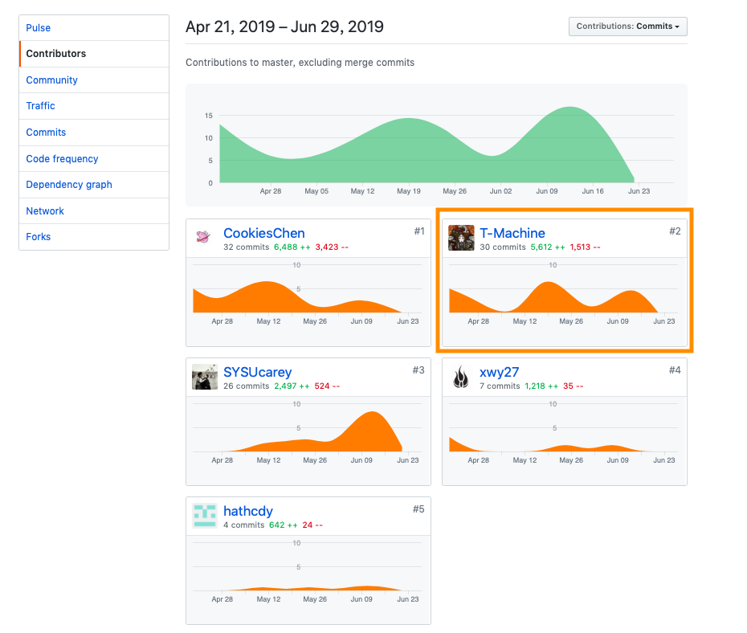

# 中山大学数据科学与计算机学院本科生实训总结报告

## 2019年春季学期

| 课程名称 | 字节跳动 iOS 开发实训 | 任课老师 | 郑贵锋 |
| :------------: | :-------------: | :------------: | :-------------: |
| 年级 | 2016 | 专业(方向) | 软件工程(数字媒体) |
| 学号 | 16340032 | 姓名 | 徐伟元 |
| 电话 | 15989012290 | Email | 1296939008@qq.com |

## 简短的课程学习自我总结

### 设计

此次项目采用的设计模式包括MVVM模式、代理模式、订阅者模式以及单例模式：

- MVVM：项目的客户端架构采用Model+View+ViewModel的框架。
- 代理模式：在TableView的高度自适应以及底部弹出组件中都使用了delegate的代理模式。
- 订阅者模式：MVVM各层之间的消息通信主要使用RAC继续信号的发布和订阅。
- 单例模式：项目登录后的用户信息存储在单例对象中，所有的ViewModel也由一个单例类来管理。

### 开发

此次项目中为负责的部分为：

- 用户界面的个人信息显示及UI布局
- 登录注册时的视图更新
- 登录状态持久化
- 设置页面的实现
- 底部弹出输入框的组件封装
- 用户界面的收藏夹实现

## 个人分支的 GIT 统计报告

### 个人贡献

## 自认为最得意/或有价值/或有苦劳的工作清单

### 最得意

- 收藏夹中的TableViewCell高度自适应。
- 收藏夹各个子页面的切换。
- 用户界面UI变化时的过渡动画。

### 最有价值

- 封装了底部弹出输入框组件。

- 登录状态持久化。

### 最有劳苦

用户界面的UI布局，各子页面间的跳转逻辑以及异步网络请求结束后的消息通知。

## 项目地址

https://github.com/CookiesChen/YesterdayNews

## 技术报告