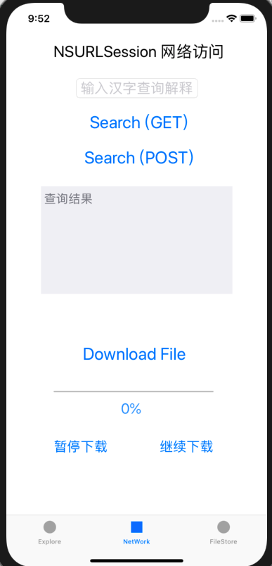

## 第三周周报


IOS的网络访问主要基于NSURLSession，它对各种网络任务进行了封装，并且实现了多线程。我们可以将网络请求交给NSURLSession进行处理，返回的结果通过block回调的方式获取，同时还能通过代理对该过程进行监听。使用NSURLSession进行网络访问的主要步骤如下：

- 创建并初始化Session
- 创建请求的URL或URLRequest
- 创建NSURLSessionTask，设置回调block
- 执行Task
- 如果是下载请求可以重载代理方法进行监听


#### 初始化NSURLSession

初始化NSURLSession时需要设置多个参数：

```objective-c
sessionWithConfiguration:delegate:delegateQueue:
```

NSURLSessionConfiguration对象用于对NSURLSession进行配置，它定义了使用 NSURLSession 对象上传和下载数据时使用的行为和策略。在NSURLSession初始化时需要指定配置，之后修改NSURLSessionConfiguration对象则不会影响其配置。如果需要修改配置，则需要用修改后的Configuration对象来创建新的NSURLSession。

`[NSURLSessionConfiguration defaultSessionConfiguration]`用于创建一个默认的配置对象，配置后的Session会使用一个持久的基于磁盘的缓存。

delegate参数用于指定session对象的代理，可以直接指定为self。

delegateQueue参数指定代理方法在哪个队列中执行，这决定了它在哪个线程中调用。如果是主队列（mainQuene）则在主线程中执行，否则在子线程中执行。

```objective-c
NSURLSessionConfiguration *defaultConfigObject = [NSURLSessionConfiguration defaultSessionConfiguration];
    
NSURLSession *delegateFreeSession = [NSURLSession 		sessionWithConfiguration:defaultConfigObject
delegate: self
delegateQueue: [NSOperationQueue mainQueue]];
```


#### 创建请求

##### 创建NSURL

普通的**GET**请求可以直接通过URL来创建Task，URL可以直接用字符串来初始化：

```objective-c
NSString *urlString = [[NSString alloc] initWithFormat:@"http://v.juhe.cn/xhzd/query?key=4bf056d6ac33cc971ed0a7b6c4584b40&word=%@", [self.inputText text]];
NSURL * url = [NSURL URLWithString:urlString];
```

##### 创建NSURLRequest

请求可以基于URL来创建。可以使用NSURLRequest及NSMutableURLRequest。

NSMutableURLRequest是NSURLRequest的子类，常用方法有：

设置请求方法，默认为GET：

```objective-c
- (void)setHTTPMethod:(NSString*)method;
```

设置请求体，包括所需的请求参数：

```objective-c
- (void)setHTTPBody:(NSData*)data;
```

设置请求头：

```objective-c
- (void)setValue:(NSString*)value forHTTPHeaderField:(NSString*)field;
```

此外还能设置超时等待时间等：

```objective-c
- (void)setTimeoutInterval:(NSTimeInterval)seconds;
```

创建一个**POST**请求：

```objective-c
NSURL *url = [NSURL URLWithString:@"http://v.juhe.cn/xhzd/query"];
//创建可变Request
NSMutableURLRequest *urlRequest = [NSMutableURLRequest requestWithURL:url];
[urlRequest setHTTPMethod:@"POST"];
[urlRequest setHTTPBody:[params dataUsingEncoding:NSUTF8StringEncoding]];
```


#### 创建NSURLSessionTask并执行

是一个抽象类，不能进行网络访问，实际操作中使用的是其子类：

- NSURLSessionDataTask，用于获取数据，如XML、JSON
- NSURLSessionDownloadTask，用于下载文件
- NSURLSessionUploadTask，用于上传文件，是NSURLSessionDataTask的子类

NSURLSessionTask可以通过`dataTaskWithURL`或`dataTaskWithRequest`创建。completionHandler参数可以设置回调操作，block中的data参数即为返回的数据。

```objective-c
NSURLSessionDataTask * dataTask = [delegateFreeSession dataTaskWithRequest:urlRequest
completionHandler:^(NSData *data, NSURLResponse *response, NSError *error) {
NSLog(@"Response: %@ %@\n", response, error);
	if(error == nil) {
		......
	}                                                            
}];
```

创建完成后执行即可进行网络访问：

```objective-c
[dataTask resume];
```


#### 使用NSURLSessionDownloadTask进行文件下载

NSURLSessionDownloadTask也可以像NSURLSessionDataTask那样创建和使用，通过block来处理回调。但是使用block的方式并不适合下载大文件，因为这样必须等到文件全部下载完毕才能回调completionHandler后的block，从而获得location(文件下载缓存的路径), response(响应信息), error(错误信息)。因而在下载的过程中无法得知相关的信息，比如下载进度。


因此对于大文件，需要使用代理的方法。这需要实现`<NSURLSessionDownloadDelegate>`协议。

常用的代理方法有：

- 下载数据的过程中调用的代理方法：

  ```objective-c
  -(void)URLSession:(NSURLSession *)session downloadTask:(NSURLSessionDownloadTask *)downloadTask
  didWriteData:(int64_t)bytesWritten totalBytesWritten:(int64_t)totalBytesWritten totalBytesExpectedToWrite:(int64_t)totalBytesExpectedToWrite
  ```

  这个方法会在每次写入数据时被调用，其各参数为：

  - session：当前会话
  - downloadTask：当前的会话任务
  - bytesWritten：本次写入的数据大小
  - totalBytesWritten：已写入的数据总大小
  - totalBytesExpectedToWrite：要下载的文件总大小

- 下载完成后写入数据到本地时调用的代理方法：

  ```objective-c
  -(void)URLSession:(NSURLSession *)session downloadTask:(NSURLSessionDownloadTask *)downloadTask
  didFinishDownloadingToURL:(NSURL *)location
  ```

  其location参数为下载到缓存中的.tmp文件的路径，如果要保存文件则需要在该方法中将.tmp文件转移到document中。

- 中断下载后重新恢复时调用的代理方法：

  ```objective-c
  -(void)URLSession:(NSURLSession *)session downloadTask:(NSURLSessionDownloadTask *)downloadTask
  didResumeAtOffset:(int64_t)fileOffset expectedTotalBytes:(int64_t)expectedTotalBytes
  ```

  - fileOffset：当前已下载完的部分大小
  - expectedTotalBytes：所要下载的文件的总大小

- 请求失败返回错误时调用的代理方法：

  ```objective-c
  -(void)URLSession:(NSURLSession *)session task:(NSURLSessionTask *)task didCompleteWithError:(NSError *)error
  ```

  error用于获取相应的错误信息。


此外大文件还能实现断点续传下载。NSURLSessionDownloadTask有以下几个方法用于控制文件下载进度：

```objective-c
// 暂停下载，可以重新恢复进度
- (void) suspend;
// 取消下载，不可恢复进度
- (void) cancel;
// 取消下载的同时记录下当前的进度resumeData，可以用于重启任务时恢复
- (void) cancelByProducingResumeData:^(NSData * _Nullable resumeData) : ;
// 重新启动任务
- (void) resume;
```

对于同一个NSURLSessionDownloadTask对象，可以在下载执行的过程中调用suspend来暂停，之后用resume来恢复。


### 实践



#### GET网络访问

  使用GET网络访问调用新华字典API，根据用户输入的汉字查询相应的解释，实现步骤如下：

- 创建默认的NSURLSessionConfiguration对象
- 初始化NSURLSession
- 从TextField控件获取用户输入，与相应的API地址组合成URL字符串，同时处理中文字符的编码使该URL有效，然后创建NSURL对象
- 创建NSURLSessionDataTask，在回调中解析返回的JSON数据，并显示到UI控件上
- 执行Task

```objective-c
- (void) sendHTTPGet {
    NSURLSessionConfiguration *defaultConfigObject = [NSURLSessionConfiguration defaultSessionConfiguration];
    
    NSURLSession *delegateFreeSession = [NSURLSession sessionWithConfiguration: 	defaultConfigObject
delegate: self
delegateQueue: [NSOperationQueue mainQueue]];
    // 创建URL
    NSString *urlString = [[NSString alloc] initWithFormat:@"http://v.juhe.cn/xhzd/query?key=4bf056d6ac33cc971ed0a7b6c4584b40&word=%@", [self.inputText text]];
    // 处理中文字符
    urlString = [urlString stringByAddingPercentEncodingWithAllowedCharacters:[NSCharacterSet characterSetWithCharactersInString:@"`#%^{}\"[]|\\<> "].invertedSet];
    NSURL * url = [NSURL URLWithString:urlString];    
    NSURLSessionDataTask * dataTask = [delegateFreeSession dataTaskWithURL:url
completionHandler:^(NSData *data, NSURLResponse *response, NSError *error) {
				if(error == nil) {                                                        
						[self changeTextView1: data];
				}
		}];
    [dataTask resume];
}
```

#### POST网络访问

使用相同的API，改用POST的形式对其进行访问，步骤如下：

- 创建默认的NSURLSessionConfiguration对象
- 初始化NSURLSession
- 根据API地址创建NSURL对象，然后创建NSMutableURLRequest对象
- 将Request的请求方式设置为POST，将相应的参数设置到请求体中，处理中文字符编码
- 创建NSURLSessionDataTask，在回调中解析返回的JSON数据，并显示到UI控件上
- 执行Task

 ```objective-c
- (void) sendHTTPPost {
    NSURLSessionConfiguration *defaultConfigObject = [NSURLSessionConfiguration defaultSessionConfiguration];
    
    NSURLSession *delegateFreeSession = [NSURLSession sessionWithConfiguration: defaultConfigObject
delegate: self
delegateQueue: [NSOperationQueue mainQueue]];
    // 创建Request
    NSURL *url = [NSURL URLWithString:@"http://v.juhe.cn/xhzd/query"];
    NSMutableURLRequest *urlRequest = [NSMutableURLRequest requestWithURL:url];    
    // 处理中文字符
    NSString *word = [[self.inputText text] stringByAddingPercentEncodingWithAllowedCharacters:[NSCharacterSet characterSetWithCharactersInString:@"`#%^{}\"[]|\\<> "].invertedSet];
    NSString *params = [[NSString alloc] initWithFormat:@"word=%@&dtype=&key=4bf056d6ac33cc971ed0a7b6c4584b40", word];
    // 设置Request
    [urlRequest setHTTPMethod:@"POST"];
    [urlRequest setHTTPBody:[params dataUsingEncoding:NSUTF8StringEncoding]];
    // 创建Task
    NSURLSessionDataTask * dataTask = [delegateFreeSession dataTaskWithRequest:urlRequest
completionHandler:^(NSData *data, NSURLResponse *response, NSError *error) {                                                             
				if(error == nil) {
						[self changeTextView1: data];
				}                                                            
		}];    
    [dataTask resume];
    
}
 ```

#### 文件下载

