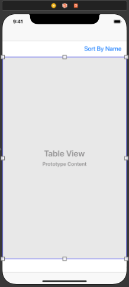
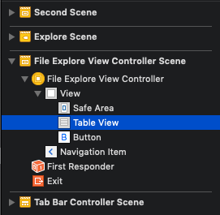
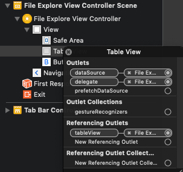
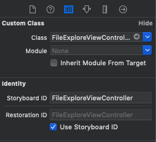
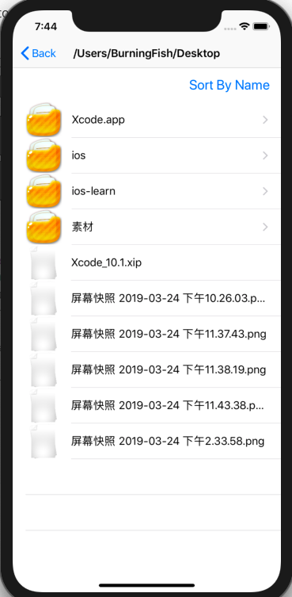

## 第二周周报

### 文件浏览器的制作

#### StoryBoard的使用

首先在创建项目时选择Tabbed App模板，就能在首页生成一个UITabBarController，这是一个选项卡，可以在底部进行Scene的切换。进入项目之后打开Main.storyboard就能直观地看到各个页面之间的跳转关系以及各页面的初始效果。

在左侧的面板中可以看到各个页面所包含的控件，在右侧的属性面板中可以看到各个页面或控件的各种属性。点击主面板右上角的圆形图标可以创建新的控件或页面，并拖动到主面板中。这里创建了项目之后会有一个TabBarController页面，它会连接着两个页面(FirstSence, SecondScene)，为了后续的操作，这里将FirstScene删除，并新建一个NavigationController页面，按住control点击TabBarVontroller并拖动到NacigationController就能快捷定义两者间的跳转关系。然后在新建一个ViewController页面，用同样的方法将NacigationController与之相连。

每个页面都能在属性面板中通过设置Class选项来与相应的Controller代码相联系，这样就能将自己定义的ViewController类关联到新的页面上。


#### UITableView的使用

TableView是一个竖直方向滑动的列表，表项可以分为多个组，每一组都是一个section。每个表项为一行，每行都是一个UITableViewCell对象。这里使用代码的方式在自己定义的ViewController类中创建一个TableView。

当要使用TableView时，该类需要实现两个协议：UITableViewDataSource(负责数据源的通过), UITableViewDataDelegate(负责布局和相关的交互)，因此必须重载以下几个函数：

```objective-c
#pragma mark ------------ UITableViewDataSource ------------------
//返回section的数量
- (NSInteger)numberOfSectionsInTableView:(UITableView *)tableView;
//返回各个section中的行数
- (NSInteger)tableView:(UITableView *)tableView numberOfRowsInSection:(NSInteger)section;
//返回每个TableViewCell对象，即定义每个表项该如何显示
- (UITableViewCell *)tableView:(UITableView *)tableView cellForRowAtIndexPath:(NSIndexPath *)indexPath;

#pragma mark ------------ UITableViewDelegate ------------------
//定义各个表项的选中事件
- (void)tableView:(UITableView *)tableView didSelectRowAtIndexPath:(NSIndexPath *)indexPath;
```

UITableView在创建时可以选择两种风格：UITableViewStyleGrouped和UITableViewStylePlain，前者的每个section之间会有空白区域，后者没有。创建了对象之后需要指定数据源和交互对象，这里直接指定为self，即Controller本身。最后调用self.view的addSubview来将该tableView添加到视图上。

```objective-c
self.tableView = ({
    UITableView *tableView = [[UITableView alloc] initWithFrame:self.view.bounds style:UITableViewStyleGrouped];
    tableView.delegate = self;
    tableView.dataSource = self;
    tableView;
});

[self.view addSubview:self.tableView];
```

文件浏览器的数据源为不同的文件和目录，因此这里用数组来存放相关信息，并保存当前页面对应的文件路径：

```objective-c
@property(nonatomic, strong) NSString *path;
@property(nonatomic, strong) NSMutableArray<NSString*> *file_list;
@property(nonatomic, strong) NSMutableArray<NSString*> *directory_list;
```

由于整个TableView分为两个部分，一个用于显示当前路径下的所有目录，另一个显示所有文件，故分成两个section，每个section的行数与相应数组中的元素数量相同，因此重载函数的实现如下：

```objective-c
- (NSInteger)numberOfSectionsInTableView:(UITableView *)tableView {
    return 2;
}

- (NSInteger)tableView:(UITableView *)tableView numberOfRowsInSection:(NSInteger)section {
    if (section == 0) {
        return self.directory_list.count;
    } else if (section == 1) {
        return self.file_list.count;
    }
    return 1;
}
```

接下来需要定义每个Cell的显示，也就是实现cellForRowAtIndexPath方法。该方法的参数为一个NSIndexPath对象，该对象中包含了section和row属性，用于确定某个cell在Table中的位置。

##### Cell的重用

由于内存限制，UITableView只会创建足够填充屏幕数量的Cell，当滚动列表时，部分UITableViewCell会移出窗口，这些Cell会被存放在一个缓冲池中，等待重用。当UITableView要求dataSource返回UITableViewCell时，dataSource会先查看这个缓存池，如果池中有未使用的UITableViewCell，dataSource会用新的数据配置这个UITableViewCell，然后返回给UITableView，重新显示到窗口中，否则会创建新的对象。

每个Cell的contentView下有三个子视图，textLabel和detailTextLabel用于显示文字，imageView用于显示图片。创建Cell时可以设置UITableViewCellStyle属性来决定使用哪些子视图。

可以根据每个Cell的不同位置来设置不同的子视图显示，并且可以设置accessoryType属性来显示辅助指示图，这是一个显示在每行右侧的图标，有DisclosureIndicator, DetailButton, DetailDisclosureButton, Checkmark等几种。

```objective-c
- (UITableViewCell *)tableView:(UITableView *)tableView cellForRowAtIndexPath:(NSIndexPath *)indexPath {
    NSString *cellID = [NSString stringWithFormat:@"cellID:%zd", indexPath.section];
    //重用
    UITableViewCell *cell = [tableView dequeueReusableCellWithIdentifier:cellID];
    if (nil == cell) {
        cell = [[UITableViewCell alloc] initWithStyle:UITableViewCellStyleDefault reuseIdentifier:cellID];
    }
    
    if(indexPath.section == 0) {
        cell.imageView.image = [UIImage imageNamed:@"icon_directory.jpg"];
        cell.textLabel.text = self.directory_list[indexPath.row];
        //设置附加按钮样式
        cell.accessoryType = UITableViewCellAccessoryDisclosureIndicator;
    } else if(indexPath.section == 1) {
        cell.textLabel.text = self.file_list[indexPath.row];
    }
    
    return cell;
}
```


#### 页面间的跳转 NavigationController

定义完TableCell的视图后需要处理交互。当点击目录表项时需要展开显示该文件夹，点击文件表项时需要显示文件的详细属性。因此需要定义页面间的跳转。

##### 自定义init方法

对于文件夹，其展开后仍是由文件夹和文件组成的TableView，因此可以直接用同样的Controller来创建新页面。创建新页面时需要传递一个NSString参数来表示新页面对应的文件目录，O-C中可以通过自定义的构造方法来完成这一操作。自定义的构造方法名称需要以`initWith`开头，可以带参数，并且在实现时需要调用超类中的`init`方法，最后要返回self对象：

```objective-c
//自定义构造方法
- (instancetype)initWithPath:(NSString *)path {
    // 属性赋值
    if (self = [super init]) {
        self.path = path;
    }
    return self;
}
```

对于文件，由于显示视图不同，故需要创建一个新的Controller，该Controller的实现与当前的大致相同。

##### navigationController

页面视图是以堆栈的形式管理的，通过push和pop操作来控制不同页面的显示。进行跳转时首先要创建新的页面，即新的Controller对象。然后调用navigationController对象的pushViewController方法即可将新的页面push到栈顶显示

```objective-c
// 用构造函数创建新页面controller
FileExploreController *newController = [[FileExploreController alloc] initWithPath:filepath];
newController.hidesBottomBarWhenPushed = YES;
[self.navigationController pushViewController:newController animated:YES];
```


#### 文件相关操作API

在创建了新的文件夹页面之后需要获取当前目录下的所有文件夹和文件，这里需要用到NSFileManager对象的contentsOfDirectoryAtPath方法，该方法会返回一个NSString组成的数组，包含各个文件的名称。对于各个文件名，可以用fileExistsAtPath:isDirectory方法来判断其是否存在以及是否是一个目录。

```objective-c
- (void)initFileData {
    NSArray<NSString*> *getFiles;
    getFiles = [[NSFileManager defaultManager] contentsOfDirectoryAtPath:self.path error:nil];
    BOOL isDirectory;
    //读取文件名
    for(NSString* filename in getFiles) {
        //加上路径前缀
        NSString *filepath = [self.path stringByAppendingPathComponent:filename];
        if([[NSFileManager defaultManager] fileExistsAtPath: filepath isDirectory: &isDirectory]) {
            if(isDirectory) {
                [self.directory_list addObject:filename];
            } else {
                [self.file_list addObject:filename];
            }
        }
    }
}
```

在文件详情视图中，需要获取文件的详细属性，这可以通过attributesOfItemAtPath方法来实现。该方法会返回一个NSDictionary对象，以键值对的形式存放所有属性：

```objective-c
- (void)initInfo {
    NSDictionary *dict = [[NSFileManager defaultManager] attributesOfItemAtPath:self.path error:nil];
    for (NSString *key in dict) {
        [self.attribute_keys addObject:key];
        [self.attribute_values addObject:dict[key]];
    }
}
```


#### 使用StoryBoard创建对象

使用代码创建TableView不太好进行布局，尤其是在一个页面中需要放置多个控件的时候。而使用storyboard则可以很方便地进行UI布局。因此这里使用storyboard的方式重新创建一个TableView。

从控件列表中选择TableView，拖动到相应的ViewController视图中。这里额外加入了一个Button控件，布局效果如下：



可以看到TableView出现在该Controller的View子控件里：



右键点击TableView可以显示其各种属性，将dataSource, delegate以及Referencing Outlets通过按住control并拖动与相应的ViewController关联起来，这样就不需要在代码中进行这些操作了。



打开双屏视图，按住control将TableView拖动至Controller代码的`@interface`区域，就能自动创建一个对应的属性：

```objective-c
@property (weak, nonatomic) IBOutlet UITableView *tableView;
```

接下来的操作与之前的方法基本相同，即重载各个函数。但是如果完全按照原来的代码写的话，进行页面跳转的时候会出现黑屏，这是因为在storyboard中设定的布局会被保存在xib文件里，而之前通过自定义构造函数来创建Controller时是不会加载这些设定的。因此需要手动初始化。

首先要给storyboard中的ViewController设定一个Storyboard ID：



然后创建UIStoryboard对象并使用这个ID来进行初始化，这样就能正常跳转与显示了。

```objective-c
// 通过storyBoardID创建新的Controller
UIStoryboard *storyboard = [UIStoryboard storyboardWithName:@"Main" bundle:nil];
FileExploreViewController *newController = [storyboard instantiateViewControllerWithIdentifier:@"FileExploreViewController"];
```


####  文件管理器扩展功能

这里增加一个按文件名称排序的功能。首先通过storyboard添加一个button，然后通过control加拖动的方式在Controller的`@interface`区域创建相应的属性，并用同样的方式在`@implementation`区域创建相应的事件响应函数，该函数会在按钮被点击时触发，可以在这里实现需要的逻辑。

使用NSMutableArray的sortUsingSelector方法对数组进行排序。由于数组元素为NSString，故可以用其自带的compare ： 方法作为selector。

修改了数组后，调用tableView的reloadData方法刷新视图。这里使用UIView的transitionWithView方法给该过程添加了一个淡入淡出的动画效果。

```objective-c
- (IBAction)onButtonClick:(id)sender {
    if (self.sortByName == YES) return;
    
    [self.directory_list sortUsingSelector:@selector(compare:)];
    [self.file_list sortUsingSelector:@selector(compare:)];
    
    //刷新&动画效果
    //[self.tableView reloadData];
    [UIView transitionWithView: self.tableView
                      duration: 0.35f
                       options: UIViewAnimationOptionTransitionCrossDissolve
                    animations: ^(void)
     {
         [self.tableView reloadData];
     }
                    completion: ^(BOOL isFinished)
     {
     }];
    
    self.sortByName = YES;
}
```

最终效果：




